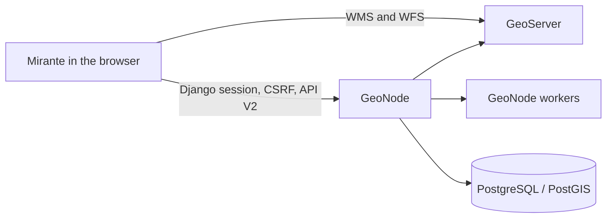

# Architecture

Mirante is a static React application and a client of GeoNode. It does not
replace GeoNode services or introduce an application backend for behavior that
GeoNode already owns.

## Responsibility boundary

GeoNode remains responsible for identities, sessions, groups, permissions,
metadata, resource ingestion, map persistence, GeoServer integration, OGC
services, storage, and asynchronous resource processing.

Mirante owns the browser experience: resource discovery, map interaction,
active layers, attribute inspection and filtering, internationalization,
branding, application composition, and supported extension points.

The recommended deployment exposes Mirante and GeoNode routes through one
public origin. The development Vite proxy implements that topology locally.

## Workspace boundaries

| Path               | Responsibility                                                                     |
| ------------------ | ---------------------------------------------------------------------------------- |
| `apps/mirante`     | Official distribution, composition, configuration, branding, and application shell |
| `packages/core`    | Application lifecycle, registries, and composition                                 |
| `packages/sdk`     | Supported contracts for build-time extensions                                      |
| `packages/geonode` | Typed GeoNode clients, upstream payload validation, and domain mapping             |
| `packages/map`     | OpenLayers implementation behind a public map facade                               |
| `packages/ui`      | Shared design tokens and presentation primitives                                   |
| `packages/i18n`    | Locale initialization, resources, validation, and localized formatters             |

Dependencies point toward public contracts. In particular:

- Application code composes packages; packages do not import the application.
- Extensions import `@mirante/sdk`, not application or package internals.
- GeoNode payload shapes do not escape `packages/geonode`.
- OpenLayers instances do not escape `packages/map`.
- Distribution choices remain outside reusable core packages.

## Configuration and extensions

An institutional distribution owns a public configuration containing GeoNode
URLs, authentication mode, branding, colors, locales, base maps, initial view,
and feature switches. See [Configuration](configuration.md).

Extensions are TypeScript modules installed at build time. They can register
toolbar actions, panels, translations, icons, authentication-provider buttons,
and capability requirements through the public SDK. Runtime remote code,
marketplaces, and Module Federation are deliberately excluded. See
[Extensions](extensions.md).

## Integration principles

1. Prefer documented endpoints shipped by the supported vanilla GeoNode.
2. Keep browser session cookies HttpOnly and obtain CSRF tokens from GeoNode.
3. Validate and bound untrusted responses before mapping them into Mirante
   models.
4. Keep authorization server-side; interface capabilities only control
   presentation.
5. Record a decision before changing public boundaries or adding infrastructure
   that an institutional distribution must operate.

The accepted decisions are indexed in [Architecture decisions](adr/README.md).
